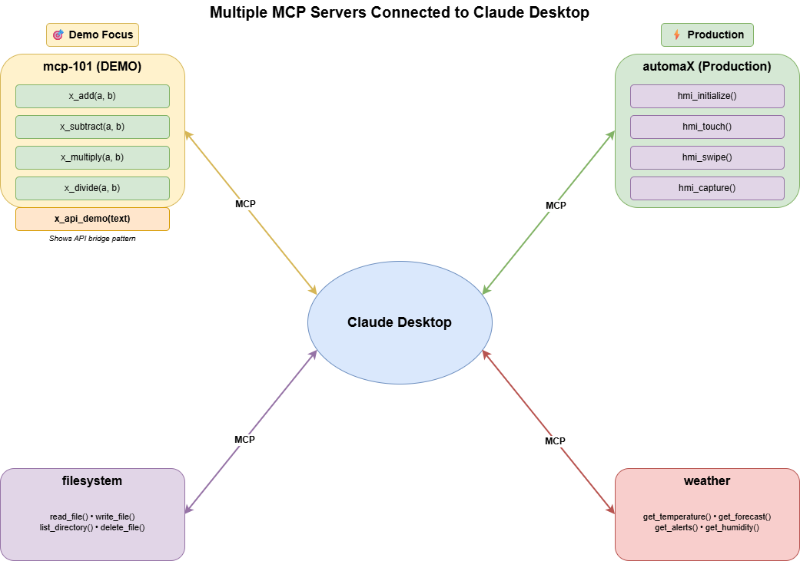

# MCP-101: Educational MCP Server

A simple, educational MCP (Model Context Protocol) server designed to demonstrate MCP fundamentals. This project helps audiences understand how MCP tools work in approximately 5 minutes.

## What is MCP?

Model Context Protocol (MCP) is a standard protocol that allows AI models to interact with external tools and services. Think of it as a bridge between AI and the real world:

```
AI Model <---> MCP Server <---> Tools/APIs/Services
```

## How MCP Servers Work

### Architecture

```
┌─────────────────────────────────────────────────────────────┐
│                        MCP Client                           │
│         (MCP Inspector / Claude Desktop / Other)            │
└─────────────────────┬───────────────────────────────────────┘
                      │
                      │  Starts & Communicates via stdio
                      │  (stdin/stdout)
                      ▼
┌─────────────────────────────────────────────────────────────┐
│                      MCP Server                             │
│                   (python process)                          │
│                                                             │
│   - Receives JSON-RPC messages on stdin                     │
│   - Sends JSON-RPC responses on stdout                      │
│   - Exposes tools, resources, prompts                       │
└─────────────────────────────────────────────────────────────┘
```

### Key Points

| Aspect | Description |
|--------|-------------|
| **Process** | MCP server runs as a child process started by the client |
| **Communication** | Uses stdio (stdin/stdout), not HTTP or sockets |
| **Protocol** | JSON-RPC 2.0 messages over stdio |
| **Lifecycle** | Client starts the server, client stops the server |

### Same Server, Different Clients

Your MCP server can be accessed by multiple clients:

| Client | How it starts the server |
|--------|--------------------------|
| MCP Inspector | `npx @modelcontextprotocol/inspector uv run python -m mcp_101.server` |
| Claude Desktop | Configured in `claude_desktop_config.json` |
| Claude Code | Configured in MCP settings |
| Custom Client | Any app implementing MCP client protocol |

Each client starts its **own instance** of the server process. They don't share the same process.

### Multiple MCP Servers with Claude Desktop

Claude Desktop can connect to multiple MCP servers simultaneously, each providing different tools:



- **mcp-101 (DEMO)**: This educational server with calculator tools
- **automaX (Production)**: Real-world example with HMI control tools
- **filesystem**: File operations
- **weather**: External API integration

## Project Structure

```
mcp-101/
├── src/
│   └── mcp_101/
│       ├── __init__.py      # Package initialization
│       ├── server.py        # MCP server setup, tool registration, routing
│       └── interactions.py  # Tool implementations (5 tools)
├── pyproject.toml           # Project dependencies
├── README.md                # This file
└── .gitignore               # Python ignores
```

## Available Tools

| Tool | Parameters | Description |
|------|------------|-------------|
| `x_add` | `a: int, b: int` | Add two integers |
| `x_subtract` | `a: int, b: int` | Subtract b from a |
| `x_multiply` | `a: int, b: int` | Multiply two integers |
| `x_divide` | `a: int, b: int` | Divide a by b (handles zero) |
| `x_api_demo` | `text: str` | Demo of API bridge pattern |

## Installation

### Prerequisites
- Python 3.10 or higher
- [uv](https://docs.astral.sh/uv/) package manager

### Install Dependencies

```bash
uv sync
```

## Usage

### Running the Server Directly

```bash
uv run python -m mcp_101.server
```

### Configuring with Claude Desktop

Add to your Claude Desktop configuration file (`claude_desktop_config.json`):

```json
{
  "mcpServers": {
    "mcp-101": {
      "command": "python",
      "args": ["-m", "mcp_101.server"],
      "cwd": "path/to/mcp-101"
    }
  }
}
```

## Demo Walkthrough

### 1. Understanding Tool Registration

Open `src/mcp_101/server.py` and look at the `list_tools()` function. Each tool is registered with:
- **name**: Unique identifier
- **description**: What the tool does
- **inputSchema**: JSON Schema defining parameters

### 2. Understanding Tool Implementation

Open `src/mcp_101/interactions.py` to see how each tool:
- Receives parameters from the AI model
- Performs its operation
- Returns structured metadata

### 3. Tool Response Format

Every tool returns a rich response:

```python
{
    "tool_name": "x_add",
    "mcp_server": "mcp-101",
    "operation": "addition",
    "inputs": {"a": 5, "b": 3},
    "result": 8,
    "message": "MCP Tool x_add: 5 + 3 = 8"
}
```

### 4. API Bridge Pattern

The `x_api_demo` tool demonstrates how MCP servers can bridge AI to external APIs. In automaX, the `hmi_touch()` function uses this pattern to call the HMI Driver API.

## Key MCP Concepts Demonstrated

1. **Server Initialization**: Creating an MCP server instance with a name
2. **Tool Registration**: Defining tools with schemas for AI understanding
3. **Tool Routing**: Dispatching tool calls to implementations
4. **Structured Responses**: Returning rich metadata for debugging/logging
5. **API Bridge Pattern**: Connecting AI to external services

## Connection to automaX

This educational server demonstrates the same patterns used in automaX:
- MCP tools bridge AI models to hardware controllers
- `hmi_touch()` in automaX calls the HMI Driver API using this pattern
- Structured responses enable traceability and debugging

## License

Educational use only.
